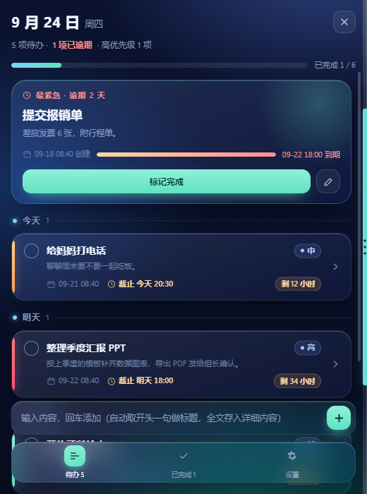
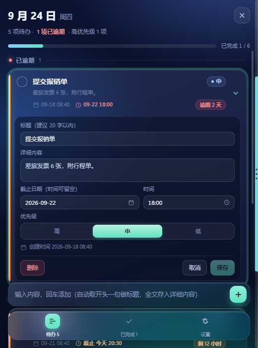
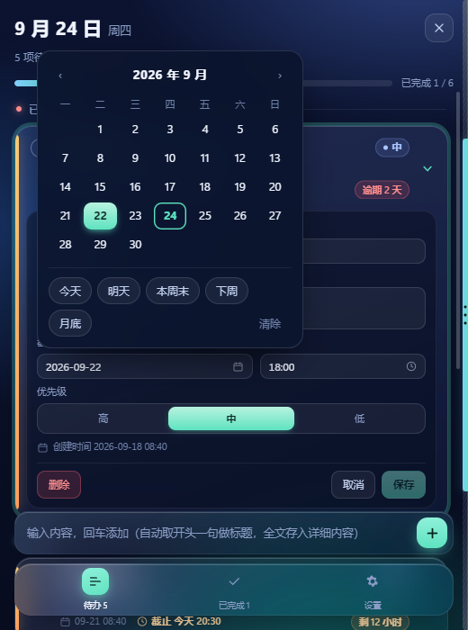
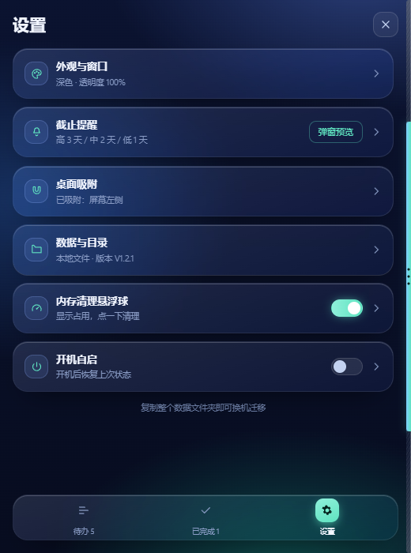
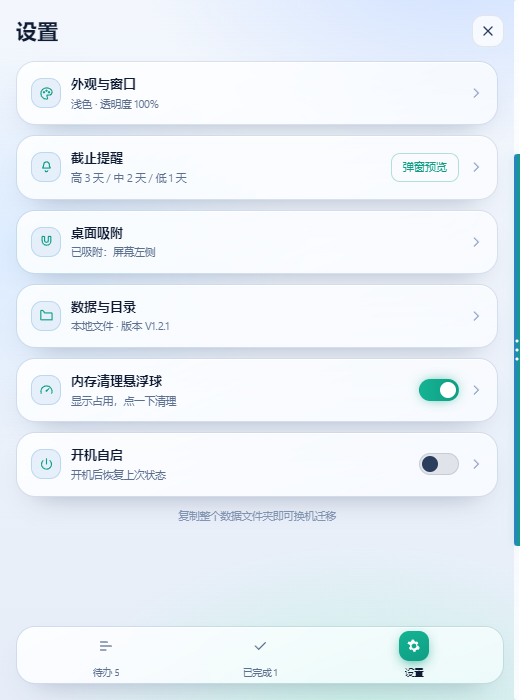
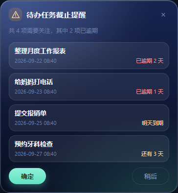
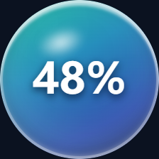

# 桌面待办 TodoManager

一个贴在屏幕边上的待办清单。

不用安装、不用注册账号、不联网：把文件夹放到哪，软件就在哪跑。平时把它拖到屏幕左边、右边或者上边，它会缩成一条 6 像素的细边藏起来；鼠标推到那条边上，界面就滑出来，鼠标离开又收回去。想关的时候点 × 只是把它收进托盘，界面上不会再占地方，任务栏里也不会留按钮。

> 只给 Windows 10 / 11 用。功能很少，但每天都在手边，这比功能多更重要。

## 长这样

深色主题，顶部是今天的日期和完成进度，底下三个入口：待办 / 已完成 / 设置。



浅色主题是同一套布局换了配色。


点开一张卡片就能改标题、详细内容、截止日期和优先级；日期是自己画的面板，带「今天 / 明天 / 本周末 / 下周」这些快捷项。




设置页一条条平铺，点开设哪一项。

<table>
<tr>
<td width="50%"></td>
<td width="50%"></td>
</tr>
</table>

到时间会单独弹窗提醒：三件以内一件一件弹，四件以上合成一张清单。

<table>
<tr>
<td width="50%"></td>
<td width="50%"></td>
</tr>
</table>

还有个可选的内存悬浮球，显示当前占用，点一下清理，按住可以拖到任意位置。



## 怎么用

1. 到 [Releases](https://github.com/lin752252801/TodoManager/releases/latest) 下载 `TodoManager-vX.Y.Z-win.zip`。
2. 解压到任意位置（桌面、D 盘都行，别留在压缩包里面运行）。
3. 双击 `TodoManager.exe`。

日常操作只有三个：

- **拖到屏幕边**：按住顶部空白处，把窗口甩到左 / 右 / 上任意一条边附近，松手就吸住了，只留一条细边。
- **推出来**：鼠标移到那条细边上（必须真的压到边上，不留误触空间），约 0.15 秒滑出完整界面；鼠标移出界面，它自己收回去。
- **收进托盘**：点 ×。想真正退出，右键托盘图标选退出。

窗口大小随便拖，界面会跟着宽度重新排版；吸在边上时也能改大小，改完仍然贴着边。

## 数据和迁移

所有东西都在软件自己那个文件夹里：

```
TodoManager/
├── TodoManager.exe
├── data/todos.json      ← 你的待办
└── config/settings.json ← 窗口位置、主题、吸附状态
```

- 换电脑：整个文件夹拷走，或者只拷 `data` 和 `config` 两个文件夹放进新版本里。
- 备份：复制 `data/todos.json` 就够了。
- 没有任何联网行为，不写注册表安装项（唯一的例外是「开机自启」开关，它只往当前用户的启动项里写一个路径，关掉即删）。

## 功能清单

| | |
| --- | --- |
| 任务 | 标题 + 详细内容分开填；优先级高 / 中 / 低；截止日期可留空；按「今天 / 明天 / 本周更早」自动分组 |
| 提醒 | 按优先级提前弹窗（高 3 天 / 中 2 天 / 低 1 天），逾期每次开机继续提醒，直到你点「确定」 |
| 窗口 | 无边框、免安装、可拖拽缩放、左右上三边吸附收起、记住上次的位置和大小、窗口透明度可调 |
| 界面 | 深色 / 浅色主题、响应式排版（窄窗口自动换布局） |
| 托盘 | 点 × 收进托盘；托盘菜单可新建、打开设置、退出 |
| 其它 | 开机自启（可选）、内存悬浮球（可选） |

## 暂时不做

底部吸附、多显示器、窗口置顶、锁定窗口位置、右键任务菜单、快捷键、搜索、分类、标签、云同步。


## 自己编译

```bash
npm install
npm start           # 开发运行
npm run build:dir   # 只打包，产物在 dist/win-unpacked
npm run ship        # 打包并同步成绿色目录 dist/TodoManager
```

打包就是普通的 `electron-builder --win --dir`，`ship` 只是多跑一步 `scripts/sync-green.js`
把中间产物同步成绿色目录 `dist/TodoManager`（同步时跳过 `config` / `data`，不会覆盖你的数据）。

技术栈就一个 Electron，界面是原生 HTML / CSS / JS，没有前端框架、没有构建步骤、没有后端。

## 许可

MIT
